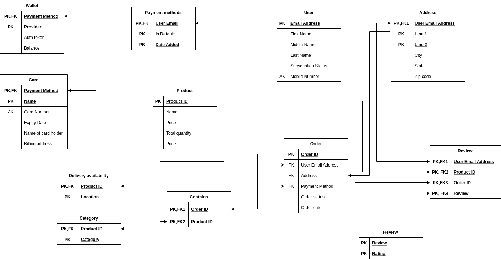

# Group Project 3

**Team Name** : Kurkure

[Link to diagram](https://app.diagrams.net/?tags=%7B%7D&title=Group%20Project%203#R7Z1fc6M4EsA%2FTR5nC4Ex9uPEyczObWZ2amavdu%2FeFENs7rDlwzhx7tOvsAX%2BI8ngBElAq2pqN8ggY7r5Sepudd94k8X2c4pX868kjJIb1wm3N97djesiPxjT%2F%2BUtr%2FuWkTPcN8zSOGQnHRp%2Bxv%2BPWKPDWjdxGK1PTswISbJ4ddo4JctlNM1O2nCakpfT055IcvqtKzyLuIafU5ywVvfQ%2BmccZnP2K3zn0P5rFM%2FmxTcjh32ywMXJrGE9xyF5OWry7m%2B8SUpItv9rsZ1ESf7wiueyv%2B6T5NPydtNomdW5YDG7%2F8fnb9j98NeHl%2BzX9Mvvi%2BHnD6yXZ5xs2A%2F%2B5zpK2Q1nr8VToPe%2Byv%2FM8GPedLvOcJoxYXkObaCPP8Pxkl7q3aHdcZLg1Trenb5vmcdJ%2BIBfySYrOiqObp%2FibRT%2B2MsqP5eK7YF2lh%2FmnT%2FRzn%2Bym8k%2Fxkk8W9K%2Fp%2FSX5994m0Zrei8PeJ2xM9ivitIs2kofFyqFQLU3IosoS1%2FpKeyCcaGBTHG94vjloAZoxNrmRypQqi5mqjcr%2Bz5Ih%2F7BBHSFsFxOWFJB0d%2BZxTj5QV8JvJztZHYqkvy5hilZ%2FYHTWZSxhhWJ8yd6%2F0yfUfnw4ySZkITkkl2SZd5TRlbswyR6Kq59JFlGFoUA2eMoO909Cv%2BW%2FqMPZ%2BL84t%2F49HYn9Bgdjum%2F%2FPQ0m5DlOkupPuV9RFSsL1Eu2npiles5L%2BtCtjVF66mSrMdJ9vtv18l2Rz98kO3VYnPOxHb%2B0hH62J%2BSHcDmcRhGy3fJwxXL40gA3pXPn3V2eCpX94YTqvtLnEW3ZLMM15xQy%2Ft8u5wHnJzvFzjOL%2FsYhpRia8NCL8i6P%2Fd2vcLTeDl72F85PNMKX5dWbOVvqd%2BoltTqToOa%2BJ0A%2FbnydAD0Q9OgH75Tso2%2F8VEYF%2F01T3kfJuUDTsif4pTqtet8w4uo7YjXogLgkD6ySFeD9LFppI9BIX0EE%2BnFmv5Iyl%2Fpw9zdLTyoS5QAHNQRbz6zVG%2BE6sg1jXX0Xmtbt7iOJPLoPdh509vOjgwR6zIdgMf1987pLNdlXPdNc93lZ3K95voYJtddfmr2c%2FO4nqbxKovJkn7yM8PZpvUGdz3aAI7wxUtvCd844UfGCc9P6T62yZvqNP5a75UXIOR5f%2BpX8hjvrTKbxeOFSJaW4N2MXsDDPe9R%2FZ6ScDPNpAoCKNTJL9yiDOF%2B3XiYsrF5hr%2FXUQo41smV%2BNzaEuzk8v7Rvkc7DYGOz7zXs8Su8%2BWuS4OzgmAniVLAG5yttU0V643HOxUdA7G2uUCtbR5vbYPnPpEJHxzQPWtcUwV049FOHm9c6zPQPaCWNY%2B3rH1P4ykwosukD4%2FodkeCKqKbj3TyYG1K8IDuSvB4s9sfJMP5df%2Fb4GUWZ6%2FA6G73JrAHYTcnKKO78XgnD9b%2BBA%2FoBoUBb2iDOGG3OxOYOvAGuaod5oAc3qgUyYXkHmUeDz3JPQbWaPbm135wdXoPoXCVjcEDcX6PyaffkGE%2Bq%2FV7D6qtZ8NG8VunNx305a1n%2B7RKjk33UUM9tqfC7P9o7Vvzmir2C5RIL%2Ft93rrW82gnv9rA1kvq%2B7yBLZ%2Fp0hbTo7xhzssUAhznB93gfCujWis4L3CMa57jg%2BP8ACjnB1LOm7asmp7PW86zB2EdKqo4L3KXawY9LIfKoNqh0kvKFyg5EvMEnItcJnxwRPdtpidlRBe4yDWbaN7reukW0f3qVE%2F9JDrvhclzgABzkcukDw%2FpdpKuDOmCHCCakQ5rku4DnaQP%2BUn6v%2BPVTV4OKITGdTtVZ9nXBVtX8Osif3quQzufk9AGQdFP%2FKJS1bUFjkoTTOPUDrrhH2nlkLxX%2B2tioPTGIQdi%2F8jkU7%2BdJAFQJ0nAO0lOQ6DaPTardZTIlOLCWO02O1bX6U5HVQxeSyzwmwG%2B8dQfI0Hyn36zfq%2FN8Fg%2F4hfbX%2BgXOXfRE94k8hR7IFgvUwpwrA%2B6YW9rZfBTBeuNZwUJeAL0nPUBUItboVZHkr7b%2BVDyLQ1RCJv1MqUAx%2Fox7y7%2FPQ1tYfEdrM%2F2Hg7rJkxXt%2Fdw7Nqh%2Ba3v%2FLjlpcXH4GqL77X54tA8aJS6dXrTAV3e8cGgCz7XrkwltqcCPH5Jm1WRWt1pqVjIz9%2FaiPpWWtwqUG%2Fc4oYE9Shb5V5xGn%2BxmT7Dgz0S1Kfs%2Fh5zjQoCD%2F0OPz%2Bw6G8G%2FcYNcMjhQyf6jn5HYhTtPfodPpTCsv6SRgBkvXWsq2K9%2BYS9yOFdab2HfbVvvaewF7jWynDWr7twVujUv%2Bxhh0P9sQ2fVQZ943l8x7CytI%2Br42Z7yfsxP3ErjPhrgAXLZWoAj%2B3diJ7qJNuNVywfw9qtOK6Oneol21Gx40oA9xDcRnSZFoBDO0L81G6yD3uyGxVvcr%2FqacDUqHZ5ckcVsBGy9rW3L9iRpPLxlSFTA3XSFW9d6X2%2BdqbWV0c1X5LE9VHN571pQTA%2FA7OxUxVKcWVU89uVpFZ3OrTE5edvbaR%2BK%2BNkq6gfmF6EIZePnmLUN70aU0x9tzqGqpd7WVDx%2Bp4UzSLhZppZ7svVAtxuFiQoev0jeo6jF6mGAFqeIa8YikuS85rhOgJRlk6V5lkuqF%2FdxpG6neuzvbpfsz4TilfdSC0oRw1jfeZVh7z1c6QW1KjufrSzgjFbpiAXxuyeGlUFVRrsCNDQCCAqqqV3BBBUWNiNALSp98u1AdA0M0hQecEu1yrVAh76vW6gv51mugr0i%2BpsaZ78S50zXr%2B570HlvmedM1crBTzqB7ZEizLqC6tu6cV%2BILDVlzP%2BQb%2FJHwCt2IKCqw3vLaS%2BRoWAR32fN%2FRb10zpmkFnrplx3diqsTKOd6TWfTsXZ37Lk%2FwjeNXuUY1y916j7K3Tmxb08maW7g3OCpZkFeXuRS9pPyvxoGE3DHHtXJJVsN58trEhuAT%2FTKEBsn7Im%2BB%2B4IxiFTjrZQoBj%2FUBb4OJwllUPHvKyDmZkSVO7g%2BtdJFE7ycKmTAP5zyQnRbkb%2FB%2Foix7Zcs0vMkIbZpni4R9SsWTvv7Frt8d%2FCs%2F%2BMUvDu%2B2xx%2FevbKj%2Fb3mNygVeBFKRDbpNKoGtetkxcAkf0aS5VoaJfRlej69l%2BaBLajI8idOkkheoQPSWvksLXftnG4KoxgFhVXs%2FKkumkeS%2FaWtWSsXCgasIh7TaoDWbEFVhC6nclIwnZKpBrwtB7Ykgzr0m186wyvKgGpUZegp9QX1qFPyHF8qhwOD9hVVGSDRvhtOsU5O9M3n5gaWug%2FVyN3XU9Tz%2Fo6PG3qTrpOR%2F9Kn2nLca1IDgHi3yfuU4b0F6biBpe9DNfL39ZLvriB%2FH6UqXk6Bpe6TagA4tLuIn7lPcCq34wH2qPiCvBClEVxPoVNXkGrRjsQ133qm61d5VETiVTYQu4KsjBA8Kq4stVbvB2RRokbrUamjGhdG6mYjmGp1p0VXuuFMb6VHpQr9IjXSi35Basaee1SYQgOkviBR4ze8aP0aTDXpr%2Fed95T0BdhbTvpOTvJF3hTNpOd95x9Nk16pvY3pM0TQ867zvXHF%2BbZZPLbff65JDwAS3vrLlRFe6FDRjHhYDnOmzhABzxvs7rerePfj78BVRJLqAUDAW4%2B5OsCLaplqBnzrPOZqaxQzfQZI%2BOI7OVuNQ57of6b76fycJB0Lh9WoI%2FDo79lUburoL6p2qpf%2B3nvtcx2b3ntA07e5gropt1RUu7QBDu5Gwn5NugAQ8rwN5y5KYvpU8%2BeBn3Gc4Mc4ibNXqYoACqYqDe9FkZ269dKUZXJzBTU57ChdmwPXx1JpDWp2BUnUQcRSeVBjqUR51W11hSq1gBfxLMjG3kbstzOOqgL7xneml2V1AcVReVDjqAa8meWBTHEWk9ZvVVRNe5uHpNARnvYT%2Bo0zktpl2Q2%2FLBvV3W2ublnm8wRv4%2FjczmXZQPLit2ZZ5kuLlPd7kN5rNcBB2ueN5XZZVqkW8AZqn7e1txH77VyWVWDf%2FLJMUOak78syX1KSqv%2FEF20pr5hyA6G9RCXg0d4zk217G2dlsm3691GubXp0SLWdHxSZtssM3WW6bu0ZukfMlVGZoFu6W7Z2gu7dpR%2FTFL8encDGuEPP3%2FOGg94OisQIxSpj5B8rTeX5%2FsA%2FU7L9HTSrcg6yKte8yklT3rZb5TxPg8oVNhJDJQXMaY9bU3kCiTdBUz0BZHQQQm8hgtMBIjiSmiK6pMqX0W47581Jte6bipDEUKFLqL5JoX5wfnEoLI4l6w4DJWN43sn3KI3pc9u5GRqWd7E2q%2FEWS8p3aRK4b2bs7Caba7%2FF3nuF%2BqbJGkJnXibPvzxb4y4IdKwQfDsdaF7lBq5ZjBhd9HVNpsO6HBm8d4r3Ro74Z4aDoIojZxcEgQaOoGJ%2FiFW6RpXONToFdYdGpdox%2B1FtqUo9oJqkOhhZqSqQqizcWNewb8YGYJ6mRdmtGksBQ0P4WVLlwK0aws8uGDlahnDrLFChdEiRaZAepoRkx0qQ4tX8Kwmj%2FIy%2FAQ%3D%3D)

Following the steps from chapter 9 of textbook we see that the diagram generated is already in 3NF form. The explanation is given as follows

### 1NF

Following the step 6 suggested in the textbook we convert multivalues attibute to relations with foreign key and composite attributes are broken into simple ones. Thus all conditions for 1NF are met.

### 2NF

Database is created such that every attribute in any relation R is functionally dependent on its primary key, Thus all conditions for 2NF are met.

### 3NF

There is no non primary attribute transitively dependent on the primary key. Also if there are two attributes such that $X \rightarrow Y$ then $X$ is a super key and $Y$ is a prime attribute.